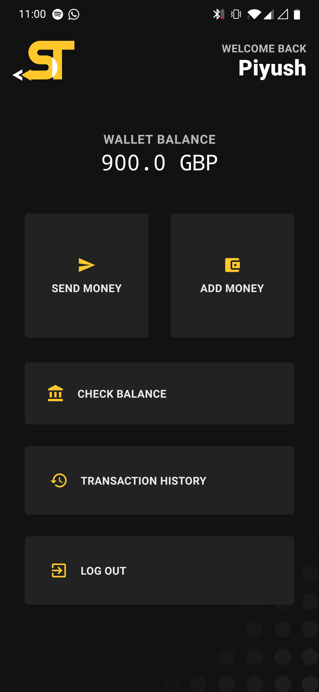
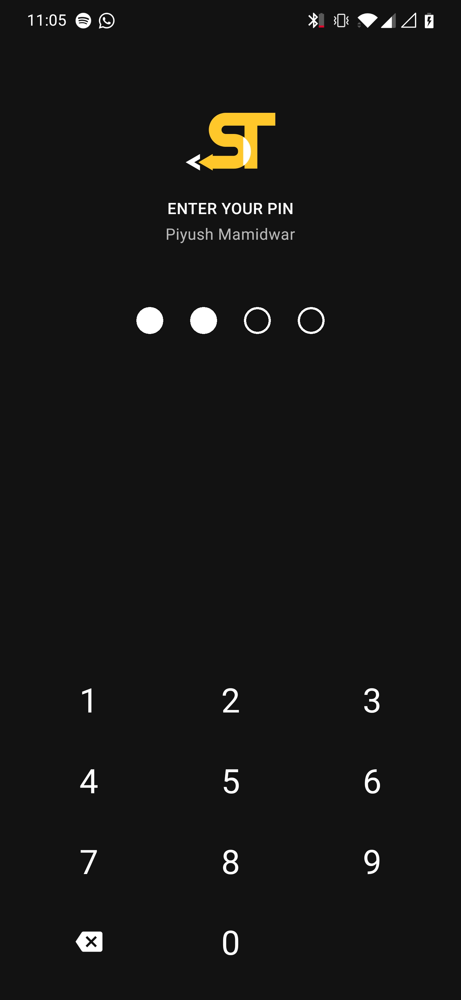
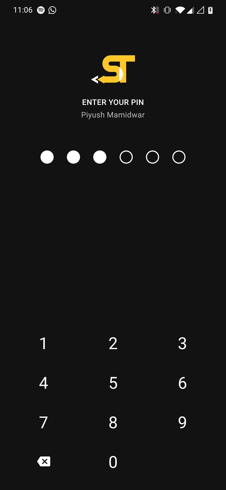
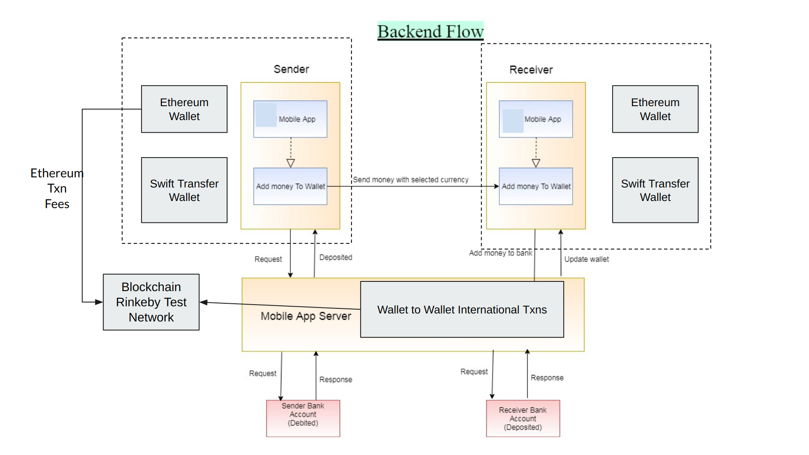

# Swift-Transfer

### Purpose 
To make international transactions faster. We will onboard banks from different countries allowing users to set up wallet account on Swift Transfer App.
Including real-time currency conversion within the app. Prevent numerous International regulations, 3rd parties, foreign exchange intermediaries to 
add to the cost of the transaction. 

### Screenshots
  
  
  

### Technology Stack
- Android SDK
- pocket-core
- Rinkeby Test Network (Ethereum)
- exchange-rate API
- Remix IDE
- Firebase

